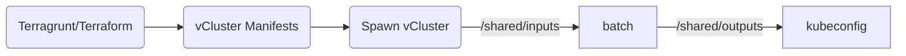

# Tools cluster

## Context

Our Golden path based platform is composed of 3 clusters:

- tools: for deploying shared tools (monitoring / rancher / SonarQube / Argo CD ...)
- dev : for deploying our review apps
- prod: for deploying UAT and production apps

This file will focus on getting the `tools` env up and running.

In this step, you will work with two repositories:

1. `password-store`, which keeps encrypted shared secrets
2. `infrastructure`, which provisions the cluster and the shared tooling

Create and clone both repositories under `/home/coder/work`.

## Bootstrap your infrastructure repo

You must start from one of the Hoverkraft templates: <https://github.com/hoverkraft-tech/infrastructure-vcluster-template>

- Click on top on 'Use this template'
- Select 'Create a new repository'
- Choose your affected org as owner
- name it `infrastructure`
- Select `Private` as visibility
- Clone the repo inside `work` folder: `git clone https://github.com/<your org>/infrastructure`

At the end of this section, you should have both a GitHub repository and a local directory named `infrastructure`.

## Bootstrap your password-store repo

To avoid committing credentials and sensitive information into a repo, we will use [password-store](https://www.passwordstore.org/).
This allows us to store encrypted secrets in a shared Git repo, while relying on GnuPG to secure the data.
A secret can then be shared among the needed number of people.
While some other tools like 1password, Bitwarden, Infisical, Vault can be used, this is a very convenient way to start quickly.

There is also a terraform provider that allows us to read a secret from a password-store repo and use it in our envs.
The SSH key used below is the one created in [01-setup-dev-env.md](01-setup-dev-env.md).

Here again, you must start from a template repository: <https://github.com/hoverkraft-tech/password-store-template>

- Click on top on 'Use this template'
- Select 'Create a new repository'
- Choose your affected org as owner
- name it `password-store`
- Select `Private` as visibility
- Clone the repo inside `work` folder: `git clone https://github.com/<your org>/password-store`

To set up your repo, run the following commands in a terminal in the repo:

```bash
mise trust
mise install
mise run gnupg:list-keys # find your own key ID (the only one available)
mise run pass:init '<MY GNUPG KEY ID>'
pass insert -m argocd/ssh/private-key < ${HOME}/work/.ssh/id_ed25519
pass argocd/ssh/private-key # verify
mise run gnupg:export-key --username 'Your full name in GPG' > '.gpg-keys/<my-shortname>.asc' # allow other members an easy setup
git add .
git commit -m "feat: add <my shortname> key"
git push
```

At the end of this section, the `password-store` repository should already contain your exported public key and the `argocd/ssh/private-key` secret entry.

## Customize your infrastructure repo

It's time to use the new `infrastructure` repository.
You can have a quick look around, but the next step is to customize it:

From this point on, stay in the `infrastructure` repository unless a step says otherwise.

- Start by opening the `landing-zones` folder
- Locate `global.yaml`
- Edit it by replacing `customer.name`, `customer.domain`, `customer.slug` by the provided values in the spreadsheet

Once done, follow these instructions to set up the tools env:

- Open the `landing-zones/tools` folder
- Locate `env.yaml`
- Customize it by replacing `vcluster.loadBalancerIp` by the provided value in the spreadsheet. Beware that in case of an overlap, both teams will not be able to provision their cluster.
- You must update `helm.argocd-apps.source-of-truth.url` to match your organization scheme

## Spawn the environment

Note: as you may have guessed from the config file, this workshop relies on vCluster to provide Kubernetes clusters as a commodity (golden paths).
The process is the following:



Terragrunt first applies the vCluster manifests, then waits for the vCluster to start, and only after that does the shared batch process the request and write the kubeconfig.

The full process can take up to 300 seconds. While Terragrunt is waiting, do not interrupt the terminal unless the command clearly failed.

Work through these steps in order:

1. Prepare the `infrastructure` repository root

- Open a terminal in the `infrastructure` repository
- Run `mise trust`
- Run `mise install`

2. Move to the tools landing zone

- Run `cd landing-zones/tools`

3. Start the provisioning process

- Run `mise trust`
- Run `mise install`
- Run `terragrunt init --all`
- Run `terragrunt apply --all`
- Answer `yes` when Terragrunt shows the plan and asks for confirmation

4. Wait for the cluster request to complete

- You should see a `wait-for-k8s` step with a countdown up to 300 seconds.
- Then wait for the batch process to satisfy the request.
- When everything succeeds, Terragrunt should finish and give you back your prompt.

If the prompt returns with an error, stop there and fix that problem before moving on to validation.

## Validation

You can validate your setup doing the following steps:

1. run `kubectl config get-contexts` and confirm that a context named `tools` exists
2. run `kubectl get nodes` and confirm that Kubernetes returns worker nodes

If step 1 fails, do not continue.
First make sure the kubeconfig was written correctly.

### GitOps validation

You should now be able to access the argocd URL mentionned in the credentials spreadsheet.

You can retrieve the argocd credentials using the following command: `mise run argocd:get-initial-admin-secret` (the user is admin).

Once you open Argo CD, you should see an application in an `Unknown` state.
This is expected at this stage: the platform is running, but the source-of-truth GitOps repository has not been created yet, so Argo CD cannot resolve that application fully.

### Commititng the changes

When all steps are done, open a terminal in the `infrastructure` repository root and commit then push your changes:

```bash
git add .
git commit -m "feat: configure tools environment"
git push
```

## Exit criteria

At the end of this step, you should have a reachable `tools` cluster, a working `tools` kubeconfig context, and be able to access to the Argo CD URL.
