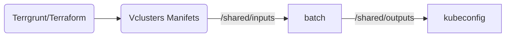

# Tools cluster

## Contexte

Our Golden path based platform is composed of 3 clusters as a basis:

- tools : for deploying shared tools (monitoring / rancher / sonaqube / argocd ...)
- dev : for deploying our review apps
- prod: for deploying UAT and production apps

This file will focus on getting the `tools` env up and runnning.

## Bootstrap your infrastructure repo

You must start from one of the Hoverkraft templates : <https://github.com/hoverkraft-tech/infrastructure-vcluster-template>

- Click on top on 'Use this template'
- Select 'Create a new repository'
- Choose your affected org as owner
- name it `infrastructure`
- Select `Private` as visibility
- Clone the repo inside `work` folder: `git clone https://github.com/<your org>>/infrastructure`

## Bootstrap your password-store repo

To avoid commiting into repo credentials and sensitive information, we will use [password-store](https://www.passwordstore.org/).
This allow to store encrypted secrets into a git shared repo, while relying on GnuPG for securing the data.
A secret can then be shared among the needed number of people.
While some other tools like 1password, Bitwarden, Infisical, Vault can be used, this is a very convenient way to start quickly.

There is also a terraform provider that allows us to read a secret from a password-store repo and use it in our envs.

Here again, you must start from a template repository : <https://github.com/hoverkraft-tech/password-store-template>

- Click on top on 'Use this template'
- Select 'Create a new repository'
- Choose your affected org as owner
- name it `password-store`
- Select `Private` as visibility
- Clone the repo inside `work` folder: `git clone https://github.com/<your org>>/password-store`

To setup you repo, run the following commands in a terminal in the repo:

```bash
mise trust
mise install
mise run gnupg:list-keys # find you own key id (the only one available)
mise run pass:init '<MY GNUPG KEY ID>'
mise insert -m argocd/ssh/private-key < ${HOME}/work/.ssh/id_ed25519
pass argocd/ssh/private-key # verify
mise run gnupg:export-key --username 'Your fullname in GPG' > '.gpg-keys/<my-shortname>.asc' # allow others memebers an easy setup
git add .
git commit -m "feat: add <my shortname> key"
git push
```

## Customize your infrastructure repo

It's time to use the new `infrastructure` repository.
You can have a quick look arround, but the next step is to customize it:

- Start by opening the `landing-zones` folder
- Locate `global.yaml`
- Edit it by replacing `customer.name`, `customer.domain`, `customer.slug` by the provided values in the spreadsheet

Once done, follow these instructions to setup the tools env:

- Open the `landing-zones/tools` folder
- Locate `env.yaml`
- Customize it by replacing `vcluster.loadBalancerIp` by the provided value in the spreadsheet. Beware that in case of an overlap, both teams will not be able to provision their cluster.
- You must update `helm.argocd-apps.source-of-truth.url` to match your organization scheme

## Spawn the environent

Note: as you can have devined from the config file this workshop rel on vCluster in order to provide you kubernetes clusters as a commodity (golden paths).
The process is the following :



The full process can take up to 300 seconds to be processed so be patient when terragrunt is waiting...

To produce the manifests in `/shared/inputs` you must follow these exact steps:

- Open a terminal in `landing-zones/tools`
- run `mise trust`
- run `mise install`
- run `terragrunt init --all`
- run `terragrunt apply --all`
- answer 'yes' after changes diff
- You should see a step wait-for-k8s with a countdown up to 300 seconds
- Wait for the batch to satisfy your request
- You should see the success of all the steps and terragrunt should give you back your prompt

## Validation

You can validate in multiples way :

- run `kubectl config get-contexts` and see that you are using a context named `tools`
- run `kubectl get nodes` and see that you are seeing some workers nodes
- access the url https:://argocd.\<your base domain\>

You can retrieve the argocd credentials using the following command: `mise run argocd:get-initial-admin-password` (the user is admin).
