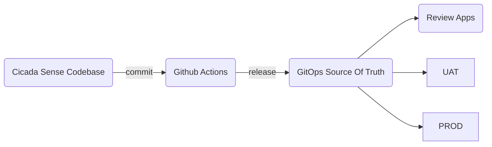

# Cicada Sense Workshop

You have just joined cigales.cloud as a senior developer in the Cicada Sense team. In your first week, you are asked to help manage `cicada-sense`, the world's leading community-driven cicada tracker, and keep it stable while new product requests are already coming.

The team is not starting from zero. Your predecessors left a production-ready application with a solid codebase, automated tests, container images, and a Helm chart. The product is live, the traffic is real, and one part is still missing: a delivery process that is safe, repeatable, and ready for change.

Step by step, you will work on the same decisions as a real team: make the integration flow safer, prepare the GitOps repository, automate releases, and move the same artifacts across environments without losing control of production.

You will do all of that in the Hoverkraft way: an opinionated platform engineering approach that helps teams spend less time on glue work and more time on the application, the delivery flow, and the operations choices behind each step.

## Goal

⚠️ **IMPORTANT** ⚠️ The goal of this workshop is **not** to copy files from one snapshot to another.

Instead, as a learner, you should understand the delivery model proposed and implement it by yourself:

1. start from a working multi-application repository
2. add CI that validates pull requests and `main`
3. prepare the `argocd-app-of-apps` GitOps repository for the application
4. add CD that prepares releases and promotes the same built artifacts to review apps, UAT, and production

At the end of the workshop, learners should be able to reproduce the following workflow on their own organization without depending on the snapshot folders.

## Journey

The application delivery part of the workshop is split across four numbered guides: Step 05, Step 06, Step 07, and Step 08.

1. Step 05: bootstrap the learner repository from the baseline and confirm it works locally
2. Step 06: add the GitHub Actions CI workflow
3. Step 07: create and initialize the GitOps source-of-truth repository and add `cicada-sense` to it
4. Step 08: add release preparation and deployment workflows in the application repository

The `steps/` folder in this repository contains reference snapshots, in case you get lost or hit an unexpected issue.
They show the expected state for each stage, but you won't learn much by copying them blindly.

Learners should:

- work in their own `cicada-sense` GitHub repository in their organization
- use the Hoverkraft docs to understand the contract
- implement the changes and commit them in the dedicated repository
- compare with the snapshots only when they need to verify their results

## Where to go next

Start with the step guide that matches your current stage:

1. Step 05: [05-start.md](05-start.md) - prepare the baseline repository and understand the repository shape
2. Step 06: [06-add-ci.md](06-add-ci.md) - implement CI in GitHub Actions
3. Step 07: [07-add-cd-gitops-repository.md](07-add-cd-gitops-repository.md) - prepare the GitOps delivery repository and scaffold `cicada-sense`
4. Step 08: [08-add-cd-application-repository.md](08-add-cd-application-repository.md) - implement release and deployment workflows

Reference snapshot for the external GitOps repository used in Step 07:

1. `steps/07-add-cd-gitops-repository` - Step 07 snapshot for the external `argocd-app-of-apps` repository scaffolded for `cicada-sense`
